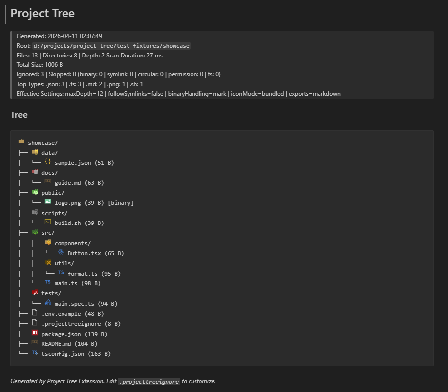
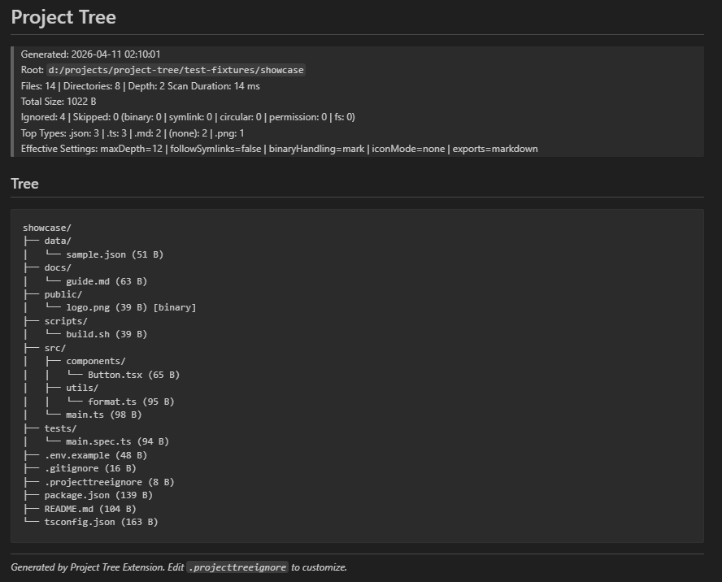

# TreeScribe - Project Tree Generator

## Summary

TreeScribe generates a clean project tree from any folder and exports it as
Markdown, JSON, or HTML. It is designed for documentation, architecture
overviews, and repository audits with layered ignore rules, safe traversal,
optional icon rendering, and rich scan metadata.

## Example Output

### With Icons



### Without Icons



## Usage

1. Open Command Palette.
2. Run `Generate Project Tree`.
3. Choose icon mode for this run.
4. Choose export format(s) for this run.
5. Open generated output file(s).

Alternative usage:

1. In Explorer, right-click any folder.
2. Run `Generate Project Tree From Here`.

## Features

- Layered ignore support from defaults, `.gitignore`, `.projecttreeignore`, and
  settings.
- Safe traversal with directory-first sorting and symlink safeguards.
- Per-run prompts for icon mode and export formats.
- Multi-format export: Markdown, JSON, HTML.
- README marker injection support.
- Rich metadata for scan diagnostics and project composition.

## Commands

- `projectTree.generate` - Generate Project Tree
- `projectTree.generateFromHere` - Generate Project Tree From Here

## Shortcuts

- Windows/Linux: `Ctrl+Shift+T`
- macOS: `Cmd+Shift+T`

## Example Use Case

You are opening a pull request for a large repository and need a structure
snapshot:

1. Run TreeScribe at repository root.
2. Select Markdown and JSON export.
3. Inject the tree into README markers.
4. Use metadata to explain ignored/skipped counts and scan behavior in the PR
   description.

## Extension Settings

| Key                               | Default               | Description                                          |
| --------------------------------- | --------------------- | ---------------------------------------------------- |
| `projectTree.additionalIgnore`    | `[]`                  | Additional ignore patterns.                          |
| `projectTree.maxDepth`            | `6`                   | Maximum traversal depth.                             |
| `projectTree.showFileSize`        | `true`                | Show file sizes in tree output.                      |
| `projectTree.followSymlinks`      | `false`               | Follow symbolic links during traversal.              |
| `projectTree.binaryHandling`      | `mark`                | `off`, `mark`, or `skip` for binary files.           |
| `projectTree.asciiOnly`           | `false`               | Render text-only tree without icons.                 |
| `projectTree.iconSource`          | `bundled`             | Icon source: `bundled`, `local`, or `remote`.        |
| `projectTree.iconAssetsDirectory` | `.project-tree-icons` | Local icon directory when using `local` icon source. |
| `projectTree.outputFileName`      | `project_tree.md`     | Markdown output path (within selected root).         |
| `projectTree.outputJsonFileName`  | `project_tree.json`   | JSON output path (within selected root).             |
| `projectTree.outputHtmlFileName`  | `project_tree.html`   | HTML output path (within selected root).             |
| `projectTree.exportFormats`       | `['markdown']`        | Default export formats.                              |
| `projectTree.injectIntoReadme`    | `true`                | Inject generated tree into README markers if found.  |

## Icon Rendering

- `bundled` (recommended): uses vendored icon assets shipped with the extension.
- `local`: downloads missing icons into the configured local icon directory.
- `remote`: uses CDN icon URLs.
- Choosing "Without Icons" during prompt forces text-only output for that run.

## Generated Metadata

Each run includes:

- Scan duration (milliseconds)
- Ignored count
- Skipped count with reason breakdown (`binary`, `symlink`, `circular`,
  `permission`, `fs`)
- Total scanned file size
- Top file types by extension
- Effective settings snapshot for the run

## README Injection

When `projectTree.injectIntoReadme` is enabled and markers are present in root
`README.md`, TreeScribe replaces the content between the markers:

```markdown
<!-- PROJECT-TREE:START -->
<!-- PROJECT-TREE:END -->
```

## Vendoring Icon Pack

Download and cache the icon set into `assets/icons`:

```bash
npm run icons:vendor
```

This is also executed by `vscode:prepublish`.

## How To Run This Project

```bash
npm install
npm run icons:vendor
npm run compile
```

Run in VS Code:

1. Press `F5` to launch Extension Development Host.
2. Open Command Palette and run `Generate Project Tree`.

Package VSIX:

```bash
vsce package
```

## Troubleshooting

- If `Generate Project Tree` fails in terminal, remember it is a VS Code command
  (not a shell command).
- If icons do not appear, verify icon mode choice and `projectTree.iconSource`.
- If output files are missing, verify output settings point to paths inside
  selected root.
- If README is not updated, ensure both markers exist exactly once in root
  `README.md`.

## Feedback/Support

We value your feedback! If you encounter any issues or have suggestions for
improvement, please feel free to raise an issue on GitHub.

- [GitHub Issues](https://github.com/dexxeth/project-tree/issues)

## License

This project is licensed under the MIT License.
